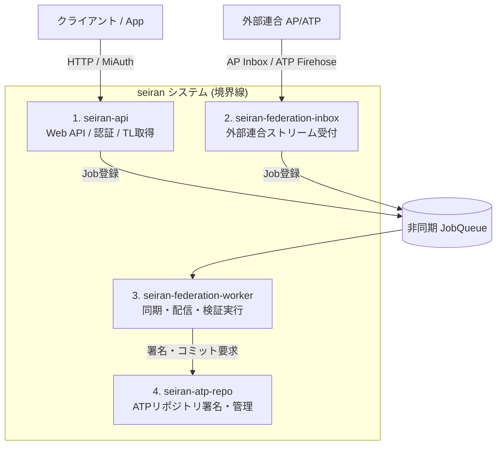

# Doc 2. アーキテクチャ ＆ 全体設計マニフェスト (Architecture & Overall Design)

## 0-0. seiran のプロトコル上の位置づけ

seiran は **ActivityPub（Fediverse）の AP サーバー**と **AT Protocol の PDS（Personal Data Server）** を兼ねるマルチプロトコル SNS サーバーである。

| プロトコル | seiran の役割 | ユーザーへの意味 |
|---|---|---|
| ActivityPub | AP サーバー（Mastodon 等と同等） | `@username@domain` で Fediverse から発見・フォロー可能 |
| AT Protocol | PDS 本体 | ユーザーの `did:plc:...` を seiran が plc.directory に登録・管理する。外部の bsky.social PDS は使用しない |

### ローカルユーザーの ATP アイデンティティ管理
- ユーザー登録時、seiran が plc.directory に `did:plc:...` を登録し、PDS エンドポイントとして seiran 自身を指定する。
- **鍵の役割分担**:
  - **ローテーション鍵（Rotation Key）**: サーバー共通の P-256 鍵（`secrets.toml` の `atproto_private_key_pem`）。plc.directory への genesis operation 署名に使用。DID の制御権（更新・移転）を持つ。
  - **署名鍵（Signing Key）**: ユーザーごとに生成する P-256 鍵（`actors.at_signing_key_pem`）。MST コミットへの署名に使用。DID Document の `verificationMethods.atproto` として公開される。
- ユーザーの AT Protocol リポジトリ（MST: Merkle Search Tree）は seiran が管理する。
- 投稿時はユーザー固有の署名鍵（`actors.at_signing_key_pem`）でコミットに署名し、Relay（`bgy.bsky.network` 等）に配信する。
- **外部 Bluesky アカウントの認証情報（App Password 等）は不要**。seiran がリポジトリ操作の主体である。

### ATP リポジトリ実装の詳細
- **MST 構築**: `seiran-common::atp::repo` モジュールが担当。SHA-256(key) の RFC 4648 base32 lowercase における先頭 'a' 個数でノード高さを決定する。
- **CIDv1**: codec=`dag-cbor` (0x71), hash=`sha2-256` (0x12)。`serde_ipld_dagcbor 0.6` + `ipld-core 0.4` で DAG-CBOR シリアライズ。
- **commit 署名**: 未署名 commit の DAG-CBOR バイト列に対し `p256::ecdsa::Signer::sign()` (内部 SHA-256)。署名は IEEE P1363 (R‖S 64 bytes) をそのまま CBOR bytes フィールドに格納。
- **CAR ファイル**: CARv1 形式（`varint(header_len) + header_cbor + blocks`）。ヘッダーは `{"roots": [commit_cid], "version": 1}`。
- **DB**: `atp_blocks` テーブル（CID → raw bytes）にすべての IPLD ブロックを保存。`atp_repo_events` テーブルで subscribeRepos 用のイベントシーケンスを管理。`event_type` カラムで `'commit'`（投稿等）と `'identity'`（handle 変更通知）を区別する。`frame_bytes` カラム（zstd 圧縮済み BYTEA）に生成した WebSocket フレームバイト列をそのまま保存し、cursor 経由の再送では再構築せずにそのまま送出する。
- **XRPC エンドポイント** (`seiran-api` で提供):
  - `GET /xrpc/com.atproto.server.describeServer` → サーバー DID・利用可能ドメイン情報（Relay の PDS 検証で呼ばれる）
  - `GET /xrpc/com.atproto.sync.getRepo?did=...` → CAR ファイル返却
  - `GET /xrpc/com.atproto.repo.getRecord?repo=...&collection=...&rkey=...` → レコード JSON
  - `GET /xrpc/com.atproto.sync.subscribeRepos?cursor=...` → WebSocket バイナリ CBOR ストリーム
- **DID 解決**: `GET /.well-known/did.json` → サーバー DID ドキュメント (`did:web:{domain}`) を返却。
- **Relay 登録**: 初回コミット時に `POST https://bsky.network/xrpc/com.atproto.sync.requestCrawl` を非同期実行。`bgs.bsky.network` は 2026 年時点で廃止済み。
- **プロフィールコミット**: ユーザー登録時に `app.bsky.actor.profile/self` レコードをコミット。AppView にアクターを認識させるために必須。
- **`atp_records` テーブル**: posts 以外の ATP レコード（profile 等）の collection/rkey/CID を管理。MST 再構築時に posts テーブルと合わせて参照する。
- **ハンドル検証（2方式）**:
  - HTTP 方式: `GET /.well-known/atproto-did` → `Host` ヘッダのサブドメインから username を抽出し、DID を `text/plain` で返却。
  - DNS TXT 方式: ユーザー登録時に Cloudflare API で `_atproto.{handle}` TXT レコード（`did={did}`）を作成し、10 分後に削除。`CLOUDFLARE_API_TOKEN` / `CLOUDFLARE_ZONE_ID` 未設定時は HTTP 方式のみ使用。Cloudflare 無料プランではワイルドカード TLS が 2 階層サブドメインに未対応なため DNS TXT 方式が必要。

---

## 0. フロントエンドAPI互換性（Misskey API互換レイヤー ＆ クライアント種別の前提）
本システムのバックエンドは、既存の豊富なMisskey互換フロントエンドエコシステムをそのままレバレッジするため、**Misskey APIの完全な互換レイヤー（エンドポイント群）**を実装する。

* **インターフェースの擬態:** クライアントからの `/api/notes/timeline` や `/api/notes/create` などの要求に対し、バックエンド（Rust）は内部でプロトコル間の歪みを吸収・変換し、Misskeyが期待するJSONスキーマに準拠して応答する。
* **ページネーションの翻訳:** IDベース（`sinceId` / `untilId`）のページネーションは、バックエンドで「統一ポストID（Snowflake）」クエリ、または外部宇宙（ATP等）のカーソル管理へと動的に翻訳される。
* **公式 Web フロントエンドとサードパーティ互換の境界:**
  * **公式フロントエンド（seiran公式Webクライアント）**: Vue.js/Vite等をフォークして開発し、拡張されたAPIレスポンスのメタデータ（アクターの `bridge_real_actor_id` や `parent_original_post_id` など）を自律的に解釈して、Doc 5で定義する高度な3ペインUI・警告モーダル・本尊ワープ等を描画する。
  * **サードパーティ製クライアント**: 特有のUI制御は行わず、Misskey標準のUIで動作させる。フォロー警告等は動作しない（例外的な存在であるため許容する）。代わりに、アクターの `bio`（自己紹介）の末尾に本尊のURLをAPIサーバー側で自動挿入するなどのフォールバックを行い、無改造クライアントでも体験価値を維持する。

---

## 1. ユーザー認証（Auth0 抽象化レイヤー ＆ MiAuth互換）

本システムは、セキュリティの堅牢性と開発速度を最大化するためAuth0を標準採用するが、将来のOSS（セルフホスト）化を見据えて認証プロバイダを抽象化レイヤー（インターフェース）で分離する。また、Misskeyアプリからの認可要求（MiAuth）を処理する互換エンドポイントを内蔵する。

### 1.1 認証インターフェース定義 (Rustイメージ)
```rust
#[async_trait]
pub trait AuthProvider: Send + Sync {
    /// フロントから届いたJWT/Tokenを検証し、プロバイダ側のシステム一意IDとメールアドレスを返す
    async fn verify_token(&self, token: &str) -> Result<ExtUserInfo, AuthError>;
}

pub struct ExtUserInfo {
    pub sub: String,       -- 例: "auth0|647x..." または local用の独自ID
    pub email: String,
}
```

### 1.2 認証方式の切り替え ＆ MiAuth互換
* **本家（`seiran.org`）:** 環境変数 `AUTH_PROVIDER=auth0`。Auth0 SDKを用いてJWTの署名検証、ソーシャルログイン（Google/Facebook等）を処理する。Misskeyアプリが `MiAuth`（`/miauth/authorize`）を要求してきた場合は、Auth0の認証セッションと紐付けてアクセストークンを発行・偽装する。
* **OSS配布版:** 環境変数 `AUTH_PROVIDER=local`。自前のPostgreSQL内のパスワードハッシュ（Argon2）検証と、内蔵SMTPモジュールによるメール確認（従来型）へフォールバックする。

### 1.3 設定ファイルとシークレット管理

設定ファイルは **Twelve-Factor App** の原則に基づき、ユーザーが編集する `.env` と、サーバーが自動生成する `secrets.toml` の2種類に分離する。

#### ディレクトリ構成

```text
config/                   ← SEIRAN_CONFIG_DIR 環境変数で指定（デフォルト: ./config）
├── (seiran.env)          ← 将来: ユーザーが書く設定をまとめるファイル
└── secrets.toml          ← 【自動生成】起動時に存在しなければ自動生成される
```

Docker 運用時はこの `config/` ディレクトリをまるごとボリュームマウントすることで、シークレットを永続化・サルベージできる。

```yaml
volumes:
  - ./config:/app/config
```

#### `secrets.toml` の内容

| フィールド | 説明 | 生成方式 |
|---|---|---|
| `jwt_secret` | ローカル認証 JWT の署名鍵（256bit / hex） | `OsRng` で毎回ランダム生成 |
| `atproto_private_key_pem` | AT Protocol PDS 署名用 P-256 秘密鍵（PKCS#8 PEM） | `SigningKey::random()` |
| `atproto_public_key_pem` | 対応する P-256 公開鍵（PEM） | 上記から導出 |
| `encryption_key` | DB 内の機密フィールド（`storage_providers.secret_key` 等）を暗号化する汎用鍵（256bit / hex） | `OsRng` で毎回ランダム生成 |

`encryption_key` を用いた暗号化方式: **AES-256-GCM**。暗号化データは `nonce(12B) || ciphertext || tag(16B)` を base64 エンコードして TEXT カラムに格納する。`encryption_key` を紛失するとオブジェクトストレージへの接続が不可能になる。

- **ユーザーが手動設定する必要は一切ない。** 環境変数 `JWT_SECRET` は廃止。
- ファイルのパーミッションは `0600`（所有者のみ読み書き可）で作成される。
- **⚠️ このファイルを Git にコミットしてはならない。**（`.gitignore` で `config/` を除外済み）
- ファイルを紛失すると、既存の JWT トークンと AT Protocol 署名がすべて無効になる。

#### 実装箇所

- `seiran-common::secrets` モジュール (`crates/seiran-common/src/secrets.rs`)
- 各バイナリの `main()` で `SecretsFile::from_env().load_or_create()` を呼び出し、返却された `Secrets` を `create_auth_provider(&secrets)` に渡す。

### 1.3.1 初回セットアップフロー

`users` テーブルにユーザーが1件も存在しない状態を「未初期化」とし、フロントエンドが専用のセットアップ画面を表示する。

#### エンドポイント

| エンドポイント | 説明 |
|---|---|
| `GET /api/setup/status` | `{ "initialized": bool }` を返す。`users` テーブルの件数で判定。 |
| `POST /api/setup` | 初回管理者ユーザーを作成する。`users` が空のときのみ受理。 |

#### リクエスト (`POST /api/setup`)

```json
{ "username": "alice", "email": "alice@example.com", "password": "..." }
```

#### 処理順序

1. `users` テーブルが空でなければ `409 ALREADY_INITIALIZED` を返して終了。
2. パスワードをハッシュ。
3. PLC genesis op を生成 → Cloudflare TXT セット → `plc.directory` へ同期 POST（最大 3 回リトライ）。
4. PLC 失敗 → エラー返却。DB は一切書き込まない。
5. PLC 成功 → `users` INSERT（`role = 'admin'`）→ `actors` INSERT → ATP プロフィールコミット。
6. JWT を発行してレスポンス。

#### 設計上のポイント

- **メール確認不要**: 管理者セットアップはサーバーへのアクセス権を持つ人間が行うため、`email_verifications` テーブルを使用しない。
- **PLC 登録は同期**: ハンドルが PLC directory に既存のエントリと衝突した場合、登録を差し戻してユーザーに別ハンドルを選ばせるために同期実行とする。通常の新規登録フローも同様。
- **ユーザーネームは任意**: `admin` 固定にすると `admin.domain` が PLC directory に既存の場合にハマるため、管理者が自由に設定できる。
- **フロントエンドの動作**: アプリ起動時に `GET /api/setup/status` を呼び、`initialized: false` であれば全ルートの代わりにセットアップ画面を表示する（react-router の Routes を置き換え）。セットアップ完了後は通常の画面フローに移行。

### 1.3.2 メディアアップロードフロー（`POST /api/drive/files/create`）

| ステップ | 処理内容 |
|---|---|
| 1 | JWT 認証（Bearer トークン必須） |
| 2 | multipart フォームから `file`（必須）と `media_type`（省略時: `"post"`）を取得 |
| 3 | `process_image()` で WebP 変換・リサイズ・SHA-256 計算・blurhash 計算 |
| 4 | `(sha256, blurhash)` 複合一致で `media_files` を検索し、一致があれば既存レコードを返す（`is_reused: true`） |
| 5 | `select_provider()` でアクティブなストレージプロバイダーを id 昇順にスキャンし、`capacity_mb` 内に収まる最初のものを採用。なければ `503 SERVICE_UNAVAILABLE` |
| 6 | S3 互換 API（`PUT`）でアップロード。ストレージキーは `media/{uuid}.webp` |
| 7 | `media_files` テーブルに INSERT |

#### `media_type` ごとのリサイズ仕様

| 値 | 変換後サイズ | 方式 |
|---|---|---|
| `avatar` | 600 × 600 | center-crop（`resize_to_fill`） |
| `banner` | 横最大 2048 × 縦最大 768 | fit-inside（縦横比維持） |
| `emoji` | 横最大 384 × 縦最大 64 | fit-inside |
| `post`（省略時） | 長辺最大 2048 | fit-inside（長辺 ≤ 2048 のときは無変換） |

出力フォーマットは常に **WebP lossless**（`image` クレートの純 Rust 実装、外部 C ライブラリ不要）。

---

## 1.4 API エラーレスポンス仕様

### 基本方針

API はエラー時に機械可読な `code` フィールドを含む JSON を返す。**ユーザー向けメッセージへのローカライズはフロントエンドの責務**であり、API はメッセージ文字列を返さない。

```json
{
  "code": "EMAIL_ALREADY_REGISTERED",
  "detail": {}
}
```

| フィールド | 型 | 必須 | 説明 |
|---|---|---|---|
| `code` | `string` | ✓ | スネークアッパーケースのエラー識別子 |
| `detail` | `object` | — | フロントエンドがメッセージ補間に使う付加情報（省略可） |

HTTP ステータスコードがエラーの大分類を示し、`code` がより詳細な種別を示す。

### エラーコード一覧

| code | HTTP | 発生箇所 |
|---|---|---|
| `EMAIL_INVALID` | 400 | メール形式が不正 |
| `INVALID_INPUT` | 400 | 必須フィールド不足・形式不正 |
| `INVALID_TOKEN` | 400 | メール確認トークンが無効または期限切れ |
| `REGISTRATION_TOKEN_INVALID` | 400 | 登録トークンが無効または期限切れ |
| `EMAIL_ALREADY_REGISTERED` | 409 | 登録済みメールアドレス |
| `USERNAME_TAKEN` | 409 | 使用済みユーザー名 |
| `INVALID_CREDENTIALS` | 401 | ログイン失敗 |
| `UNAUTHORIZED` | 401 | 認証トークンなし・無効 |
| `NOT_FOUND` | 404 | リソースが存在しない |
| `INTERNAL_ERROR` | 500 | サーバー内部エラー（詳細はサーバーログのみ） |

### 実装箇所

- `crates/seiran-api/src/error.rs` — `ApiError` enum と `IntoResponse` 実装
- `frontend/src/api/client.ts` — `ApiError` クラス・`getErrorMessage()` 関数・`ERROR_MESSAGES` マップ

### 1.5 ログイン識別子（メールアドレス or ユーザーネーム）

`POST /api/auth/login` はフィールド名を `identifier` に変更し、メールアドレスまたはローカルユーザーネームの両方を受け付ける。

```json
{ "identifier": "foo@example.com", "password": "..." }
{ "identifier": "foo",             "password": "..." }
```

**バックエンドの解決ロジック:**

1. `identifier` に `@` が含まれる → メールアドレスとして `users` テーブルを検索
2. `@` が含まれない → ユーザーネームとして `actors` テーブルを検索（`domain = LOCAL_DOMAIN AND username = $1`）し、紐付く `user_id` から `users` を引く

どちらの場合も、ヒットしなければ `INVALID_CREDENTIALS`（404 情報を漏らさないために 401 を返す）。

---

### 1.6 パスワードリセット

メール送信基盤（SMTP）が整ったため、パスワードリセットフローを提供する。

#### フロー

1. **`POST /api/auth/request-password-reset`** — `{ email }` を受け取り、`password_resets` テーブルにトークンを生成してリセットリンク（`https://{LOCAL_DOMAIN}/reset-password?token={token}`）をメール送信。メールアドレスが存在しない場合でも同一レスポンスを返す（ユーザー列挙攻撃防止）。
2. **`GET /api/auth/verify-reset-token?token=...`** — トークンを検証（`used_at IS NULL` かつ `expires_at > NOW()`）して有効な場合は `{ "valid": true }` を返す（副作用なし）。有効期限は **1時間**。
3. **`POST /api/auth/reset-password`** — `{ token, new_password }` を受け取り、パスワードハッシュを更新し `password_resets.used_at` に現在時刻を記録（使い捨て）。

#### DB テーブル

```sql
CREATE TABLE password_resets (
    id         BIGINT PRIMARY KEY,
    user_id    BIGINT NOT NULL REFERENCES users(id) ON DELETE CASCADE,
    token      UUID NOT NULL UNIQUE DEFAULT gen_random_uuid(),
    expires_at TIMESTAMPTZ NOT NULL DEFAULT now() + INTERVAL '1 hour',
    used_at    TIMESTAMPTZ,
    created_at TIMESTAMPTZ NOT NULL DEFAULT now()
);
CREATE INDEX idx_password_resets_token ON password_resets(token);
```

`verify-reset-token` は SELECT のみ（副作用なし）。トークンの消費は `reset-password` にて `used_at = NOW()` を SET する（論理削除方式）。

#### エラーコード追加

| code | HTTP | 説明 |
|---|---|---|
| `RESET_TOKEN_INVALID` | 400 | リセットトークンが無効または期限切れ |
| `PASSWORD_TOO_SHORT` | 400 | パスワードが短すぎる（8文字未満） |

---

### 1.7 Turnstile 自然人判別（オプション）

Cloudflare Turnstile をログイン・新規登録フォームに組み込み、ボット登録を防止する。サーバー側の `TURNSTILE_SECRET_KEY` 環境変数が設定されている場合のみ検証を行い、未設定の場合はスキップする。

#### フロー

1. フロントエンドが Turnstile ウィジェットを描画し、ユーザーがチャレンジを完了するとトークンを取得する
2. API リクエストのボディに `cf_turnstile_response` フィールドとして含める
3. バックエンドが `https://challenges.cloudflare.com/turnstile/v0/siteverify` にトークンを POST して検証
4. 検証失敗時は `TURNSTILE_FAILED`（400）を返す

#### 設定

```env
TURNSTILE_SITE_KEY=0x4AAAAAAA...     # フロントエンド用（公開可）
TURNSTILE_SECRET_KEY=0x4AAAAAAA...   # バックエンド検証用（非公開）
```

`TURNSTILE_SECRET_KEY` が未設定の場合、バックエンドは `cf_turnstile_response` フィールドを無視して通過させる。これにより開発環境やセルフホスト環境での設定が任意になる。

#### 対象エンドポイント

- `POST /api/auth/verify-email`（新規登録入口）
- `POST /api/auth/login`
- `POST /api/auth/request-password-reset`

---

### 1.8 Note 詳細エンドポイント（AP エントリーポイント兼用）

`/notes/:id` は **ブラウザ向け SPA** と **Fediverse サーバー向け ActivityPub** の両方に応答する。

#### コンテンツネゴシエーション（nginx）

nginx の `map` ディレクティブで `$http_accept` を検査し、転送先を切り替える。

```nginx
map $http_accept $notes_upstream {
    default                        "frontend:5173";
    "~*application/activity\+json" "api:3000";
    "~*application/ld\+json"       "api:3000";
}
```

| クライアント | Accept ヘッダー | nginx の転送先 |
|---|---|---|
| ブラウザ | `text/html, ...` | frontend（Vite SPA） |
| Mastodon 等 | `application/activity+json` | api（AP Note JSON） |

#### コンテンツネゴシエーション（Vite dev server、ローカル開発）

`cargo run`（`seiran-server` を直接起動し nginx を経由しない構成）時は、`frontend/vite.config.ts` の `server.proxy["/notes"]` に設定した `bypass` 関数が同じ判定を行う。`Accept` ヘッダーが `application/activity+json` または `application/ld+json` の場合のみ `bypass` が `undefined` を返してバックエンド（`localhost:3000`）へプロキシし、それ以外は `req.url` を返して Vite 自身（SPA fallback）に処理させる。

#### ブラウザフロー

1. ブラウザが `/notes/:id` を要求 → nginx が frontend へ転送
2. React Router が `/notes/:id` にマッチし `NoteDetail` コンポーネントをレンダリング
3. `NoteDetail` が `GET /api/notes/:id` を呼んで投稿データを取得・表示

#### ActivityPub フロー

1. Fediverse サーバーが `GET /notes/:id`（`Accept: application/activity+json`）を要求
2. nginx が api へ転送
3. `GET /notes/:id` ハンドラがローカルポストのみ AP Note JSON を返す
4. レスポンス `Content-Type: application/activity+json; charset=utf-8`

AP Note の形式:

```json
{
  "@context": "https://www.w3.org/ns/activitystreams",
  "type": "Note",
  "id": "https://seiran.org/notes/123456789",
  "url": "https://seiran.org/notes/123456789",
  "attributedTo": "https://seiran.org/users/alice",
  "content": "<p>投稿本文（HTML エスケープ済み）</p>",
  "published": "2026-07-01T12:00:00Z",
  "to": ["https://www.w3.org/ns/activitystreams#Public"],
  "cc": ["https://seiran.org/users/alice/followers"]
}
```

---

## 2. 統一アクターモデルの実装ロジック

`actors` テーブルにおける「魂の結合」と「影武者紐付け」を処理するためのビジネスロジック。

### 2.1 リモート seiran ユーザーのペアリング（魂の結合）
他インスタンスの `seiran` ユーザーを発見した際、AP宇宙のレコード（行A）とATP宇宙のレコード（行B）の双方の `seiran_pair_actor_id` に互いの主キーIDを書き込む。
* アプリケーション層は、`actor_type == 'remote_seiran'` を検知した場合、常に `seiran_pair_actor_id` の有無を確認し、存在すればUIやクエリで2つのレコードを「単一のアイデンティティ」としてマージ処理する。

### 2.2 ブリッジユーザー（影武者）の判定
外部ブリッジ（Brid.gy等）によって自動生成されたアクターをインポートする際、以下のルールで `bridge_real_actor_id` をバインドする。
* Fedi側で `*.brid.gy` 由来のアカウントを検出 ➔ オリジナルのBluesky DIDを特定し、その本尊レコードのIDを `bridge_real_actor_id` に格納。
* Bsky側で `*.fed.brid.gy` 由来のアカウントを検出 ➔ オリジナルのFedi Actor URIを特定し、その本尊レコードのIDを `bridge_real_actor_id` に格納。

### 2.3 プロフィール API のメタデータ公開（フロントエンド介入用）
公式フロントエンドがブリッジ介入（本尊ワープ・フォロー警告）と魂の結合判定を行えるよう、`GET /api/users/profile` は以下の拡張メタデータを返す。
* `bridge_real_handle`: `bridge_real_actor_id` が埋まっている場合、本尊アクターのハンドル（`@user` / `@user@domain`）。フロントは「本尊ワープ」ボタンの遷移先に使用する。
* `bridge_protocol`: 本尊が属するプロトコル（`bsky` / `fedi`）。導線アイコンの出し分けに使用。
* `is_paired`: `seiran_pair_actor_id` の有無（魂の結合済みか）を表す真偽値。
* `at_did` / `bio`: プロトコルアイデンティティ表示とプロフィール本文。

### 2.4 認証情報 API の役割公開（管理画面の表示制御用）
`GET /api/auth/me`（および `login` / `register` / `setup` が返す `AuthResponse.user`）は `role`（`user` / `moderator` / `admin`）を含む。公式フロントエンドはこの値で管理メニュー（`/admin`）の表示可否を判定する。ただし表示制御は UX 上の利便であり、実際の権限検証は各管理 API 側の `require_admin` が担う（フロントの値を信頼しない）。

同レスポンスは `avatar_url`（ログイン中ユーザー自身のアイコン。解決規則は 2.5 節と同じ）も含み、左下ナビ等の自分のアイコン表示に使う。`register` / `setup` はアカウント作成直後で未設定のため常に `null`。

### 2.5 ポストのユーザーアイコン（アバター）解決
ノート系 API（`NoteResponse.user`）は投稿者のアバター URL（`avatarUrl`）を含む。解決規則:
* **ローカルアクター**: `actors.avatar_media_id` → `media_files` + `storage_providers` からオブジェクトストレージ URL を組み立てる。
* **リモートアクター**: `actors.avatar_url` をそのまま使用する。Fedi リモートは AP アクタードキュメントの `icon.url` を受信時（inbox の Follow / Create(Note)、およびこちら発フォロー時）に `actors.avatar_url` へ保存する。
* アバター未設定・取得失敗時はフロントが頭文字プレースホルダにフォールバックする。
* Bsky リモートアクターのアバター取り込みは今後対応（現状は未設定→プレースホルダ）。
* `AuthResponse.user.avatar_url`（2.4 節）とプロフィール編集画面（`GET /api/users/profile` の `UserProfile.avatar_url`）も同じ解決規則を使う。

### 2.6 サイト外観設定（名称・カラー・アイコン）
管理者が `site_settings` に保存するサイト外観を、公式フロントが起動時に取得して反映する。
* **保存**: `GET/PATCH /api/admin/site-settings`（admin 限定）が `site_name` / `site_color` / `site_icon_url` を管理する。アイコンは drive にアップロードした画像の CDN URL を `site_icon_url` に格納する。
* **公開**: `POST /api/meta`（公開）が `name`（`site_name`、未設定時 `seiran`）・`siteColor`・`siteIconUrl` を返す。
* **反映**: フロントは `site_color` から派生アクセント色（`--accent` 系 CSS 変数）を `color-mix` で生成して適用し、左ナビのロゴをサイト名称＋アイコンに差し替える。`site_color` 未設定時は既定のアクセント色を使用する。
* **Favicon（#42）**: `GET /favicon.ico`（seiran-api）が `site_icon_url` へ 302 リダイレクトする（未設定時は 404 で既定アイコンにフォールバック）。ブラウザは JS を介さず直接 `/favicon.ico` を要求するため、リンクプレビュー bot 等にも効く。加えてフロントは `<link rel="icon">` を取得済み `site_icon_url` で動的更新する（設定変更の即時反映）。nginx は `location = /favicon.ico` を backend へ転送する。
* **AP サーバー情報（#42）**: NodeInfo 2.1（`/nodeinfo/2.1`）の `metadata` に、Misskey 系の慣習に合わせ `nodeName`（`site_name`）・`themeColor`（`site_color`）・`iconUrl`（`site_icon_url`）を同梱する（値が空のものは省略）。連合先サーバーの一覧表示等でサイトアイコン・カラーが利用される。

### 2.7 リアルタイム更新のストリーミング（#37）
タイムラインの即時反映のため、プロセス内ブロードキャストハブ（`StreamHub`）と WebSocket を用いる。
* **接続**: `GET /api/streaming?token=<JWT>`（ブラウザ WS は Authorization ヘッダを付けられないためトークンはクエリ）。サーバーはトークンからローカルアクター ID を解決し、ハブを購読する。
* **配信**: `create_note` でローカルポストを作成した際、受信者集合（著者 ＋ accepted なローカルフォロワー）を計算し、`{"type":"note","body":<NoteResponse>}` をハブへ送出する。各接続は `recipients` に自分の actor ID が含まれるときのみ受信する。
* **反映**: フロントは受信したポストをホーム TL の先頭へ挿入し、`max-height` を 0 から広げる押し出しアニメーションで表示する（重複は id で排除）。切断時は自動再接続する。
* **nginx**: `location = /api/streaming` を専用ブロックにし `Upgrade` / `Connection: upgrade` を通す。
* **通知**: リアクション到達・被フォロー・フォロー承諾は `federation-inbox` クレートからも配信する。`StreamHub` を `seiran-common` に移設し、`all` ロールでは api の `stream_hub` を inbox の `init_state` に共有渡しして単一ハブで跨いで配信する（`federation` 単独ロールでは購読者が居ないため新規ハブで可）。inbox は該当イベント受理時に対象ローカルアクターだけを受信者集合とし `{"type":"reaction|follow|followAccepted","body":{...}}` を送出する。
* **リアクションのライブ反映（`noteUpdated`）**: Misskey 互換のストリーミング挙動に合わせ、リアクションの追加/切替/取消はタイムライン上の表示もリアルタイムに更新する。`seiran_common::streaming::broadcast_reaction_update`（ローカル・AP 受信いずれの経路でも共通利用、`seiran-api` の `create_reaction`/`delete_reaction` と `federation-inbox` の `handle_reaction`/`handle_undo` から呼ばれる）が、投稿の集計（`ReactionRepository::aggregate_for_post`、閲覧者ごとの `reactedByMe` は含まない）を `{"type":"noteUpdated","body":{postId, reactions:[{emoji,count}], reactorActorId, reactorEmoji}}` として送出する。受信者集合は新規ポスト配信と同じ「著者 ＋ accepted なローカルフォロワー」（「今この投稿を見ている全員」を追跡する仕組みはまだ無いため、既存のリアルタイム配信範囲に合わせている。フォロー関係の無い閲覧者がノート詳細を開いている場合は届かない）。フロントは `NoteCard` がマウント中の自ノートIDについてこのイベントを購読し、`reactorActorId` を自分の `actor_id`（`/api/auth/me` 等のレスポンスに追加）と比較して `reactedByMe` を再計算しつつリアクション表示を更新する（自分以外の操作は件数のみ反映）。単なる通知ベル用の `"reaction"` イベント（著者のみ・自作自演は送出しない）とは別に送出される。
* **フロント購読集約**: WS 接続はアプリ全体で1本に集約する（`StreamingProvider`）。`type==="note"` は登録済みリスナー（ホーム TL）へ、`type==="noteUpdated"` はノートID別リスナー（`registerReaction`、`NoteCard` が使用）へ、通知系イベント（`"reaction"|"follow"|"followAccepted"`）は未読カウント付きで通知リストへ積み、右ペイン「クイック通知」タブに表示する（タブ表示中は既読化）。

### 2.8 ポストカードの共通化（#43）
タイムライン・ポスト詳細・ユーザー詳細の各画面で、ポスト表示は単一のカードコンポーネント（フロント `components/note/NoteCard`）を共用する。最も機能が充実したタイムラインのカードを正とし、他画面へ横展開する。
* **プロフィールの投稿**: `ProfileResponse.recent_posts` を、タイムラインと同一形状の `NoteResponse`（アクター情報・添付・リアクション込み）で返す。バックエンドは `PostRepository::timeline_by_actor`（アクター指定の結合クエリ）で取得し、`fetch_attachments_map` / `fetch_reactions_map` で集計して `to_note_response` で組み立てる。フロントは受信後 `normalizeNote` で `Note` に正規化して `NoteCard` を描画する。
* **リアクション追加/取消（ローカル）**: `fetch_reactions_map` は閲覧者の `actor_id`（`my_actor_id`）を受け取り、各 `ReactionSummary` に `reactedByMe` を付与する。1投稿につきユーザー1リアクションまで（Misskey 準拠、`reactions` テーブルの `UNIQUE(post_id, actor_id)`）のため、別の絵文字を選ぶと `ReactionRepository::insert` の `ON CONFLICT DO UPDATE` により既存のリアクションが**切り替わる**（同時に2つは付かない）。フロントは `NoteCard` の `ReactionChips`（表示チップをクリックで同じ絵文字をトグル/切替）と `ReactionPicker`（固定クイック絵文字 + 自由入力のポップオーバー）から `api.notes.react` / `api.notes.unreact`（`POST`/`DELETE /api/notes/:id/reactions[...]`）を呼び、レスポンスの権威的な `reactions` 配列でローカル state を更新する（楽観的更新 + 失敗時ロールバック。切替中は他の絵文字操作もまとめてロック）。加えて、著者+フォロワーの範囲では他クライアントの操作も `noteUpdated` ストリームイベント経由でリアルタイムに反映される（§2.7 参照）。対象が AP/Fedi リモート投稿の場合は outbound 配信を行わずローカル記録のみだが、**ATP（Bluesky）へは outbound 配信する**（Doc1 §1.4 参照。`AtpCommitService::commit_like`/`delete_atp_like` で `app.bsky.feed.like` をコミット/削除し、絵文字は非標準の `emoji` 拡張フィールドとしてベストエフォートで載せる）。逆方向（ATP → ローカル）も `seiran-atp-repo` の Jetstream 受信で `app.bsky.feed.like` を検知し `reactions` へ反映する（Doc1 §1.4。`wantedCollections` で post/like 以外のcollectionはサーバー側で除外されるが、Like自体は対象が任意の投稿のためDIDでは絞り込めず、グローバルなLikeイベント全件を判定する設計になっている）。
* **ポスト詳細の主役ポスト**: 中央のフォーカス投稿も同じ `NoteCard` を用いる。大きめ文字・大きめカードで強調するため、`NoteCard` に `large` オプションを設け（アバター 48px・本文拡大・左アクセントボーダー）、`<NoteCard note large linkToDetail={false} />` で描画する。専用の focal レイアウトは廃止し、モジュールを完全共通化した。前後投稿も従来どおり `NoteCard`（通常サイズ）を用いる。

### 2.9 退会機能 Phase A（#29）

ローカルユーザーが自身のアカウントを退会する機能。不可逆操作のため `confirm_handle`（自分のハンドル入力）を API・UI 両方で必須とする。

**処理フロー** (`POST /api/account/withdraw`):
1. **AP Delete(Actor)**: `deliver_delete_actor` が Fedi フォロワー全員の inbox へ `Delete` アクティビティを配送。
2. **ATP #account**: `AtpCommitService::broadcast_account_event`（`active=false, status=deleted`）が subscribeRepos ストリームへ送出し、Relay/AppView にアカウント無効化を伝える。
3. **投稿論理削除**: `posts.deleted_at = NOW()` でタイムラインから除外。
4. **アクター退会マーク**: `actors.withdrawn_at = NOW()` をセット。

フロントエンドは `/settings/profile` の下部「危険な操作」セクションにハンドル入力確認フォームを配置。退会成功後はトークンを消去してログイン画面に遷移する。

> **Phase B 以降の課題**: PLC tombstone operation（DID の完全撤回）、サイトクローズ時の全ユーザー一括退会、退会済みアクターによる新規 API 呼び出しの完全ブロック。

### 2.10 リポストの表示（#45）
リポストは `posts.repost_of_post_id` を持つ本文空のラッパ行として保存される。表示側では「誰がいつリポストしたか」のヘッダと元ポストの中身を1枚のカードで示す。
* **API**: `NoteResponse` に `renote: Option<Box<NoteResponse>>` を追加。`renote_id`（元ポストID）を持つノートについて、`embed_renotes()` が元ポストを一括解決（アクター・添付・リアクション込み）して `renote` へ埋め込む。ホーム／ローカルTL・ポスト詳細（`GET /api/notes/:id`）・前後コンテキスト・リポスト作成レスポンスで適用する。
* **表示**: フロント `NoteCard` は `renote` があればヘッダ「（表示名）が（日時）にリポスト」＋元ポスト本体を描画する。ヘッダの日時は**リポスト自身**の詳細（`/notes/{リポストID}`）へリンクし、リポスト直後の投稿を前後コンテキストで辿れるようにする。
* **詳細画面**: `/notes/{リポストID}` を開いた場合、フォーカス投稿は元ポストの内容を本体に、上部にリポスト情報を添えて表示する。前後コンテキストは**リポスト実行者**の投稿列を対象とする。
* **リポストボタン**: `NoteCard` の各ポストカードに 🔁 リポストボタンを追加。クリック時に `api.notes.create` へ `renote_id` を渡してローカルリポストを作成し、タイムラインにリアルタイム反映される（StreamHub 経由）。
* **AP 受信リポスト（Announce）**: `seiran-federation-inbox` の inbox ハンドラが `Announce` アクティビティを受け取ると `handle_announce()` を呼び出し、元ポストを DB から検索して `repost_of_post_id` 付きのリポストレコードを挿入する。`Undo(Announce)` は対象レコードを論理削除（`deleted_at = NOW()`）する。

---

## 3. 統一ポストID 採番ルール

データベース内での完全な時系列ソート（ページネーション）を保証するため、プロトコル固有のID（URI等）とは別に、システム独自のソート可能一意IDを生成する。

### 3.1 ID構造（Snowflake / ULID準拠の64bit整数）
* **前半48bit:** ミリ秒単位のタイムスタンプ（未来補正対応）
* **後半16bit:** 衝突防止用のシリアルノードID / ランダム値

### 3.2 未来補正タイムスタンプアルゴリズム
外部プロトコルから届いたポストの `created_at` が、自サーバーの現在時刻よりも未来を指していた場合（クライアントの時計ズレ等）、そのまま格納すると最新タイムラインにそのポストが最上部に「ピン留め」された状態になりUXが破壊される。
* **補正ロジック:** `if post.created_at > SYSTEM_NOW() { id_timestamp = SYSTEM_NOW(); } else { id_timestamp = post.created_at; }`
* 採番された統一IDは `posts.id` に格納され、すべてのタイムライン描画の `ORDER BY id DESC` の主軸として機能する。

---

## 4. 大規模化を見据えた疎結合コンポーネント構成（単一バイナリ・複数ロール）

本システムは、各機能コンポーネントのインターフェースを厳格に切り離しつつ、**実体は単一の統合バイナリ `seiran-server` に集約**している。起動時の `--role`（または環境変数 `SEIRAN_ROLE`）で役割を切り替えることで、以下の2つの運用形態を同じイメージで実現する。

- **小規模構成（`role=all`、既定）**: api / federation / worker / firehose を1プロセスで同時起動し、単一コンテナで全機能を提供する。
- **大規模構成（ロール分離）**: 同じイメージを `--role` 違いで複数コンテナ起動し、ワーカーや Firehose を Web API から独立させて負荷分散する。

各ロールは以下の4つのコアコンポーネントに対応する（下記 4.1）。ソフトウェア境界（クレート分割）は維持したまま、物理境界（プロセス／コンテナ分割）を起動オプションで選べる構造とした。

### 4.0 統合バイナリ `seiran-server` のロール

| ロール | 対応クレート | 待受ポート | 内容 |
|---|---|---|---|
| `all`（既定） | 全クレート | `PORT`（既定 3000） | api + federation を1ポートに合流し、worker と firehose を同一プロセスで spawn |
| `api` | `seiran-api` | `PORT`（既定 3000） | REST API / 認証 / タイムライン / XRPC |
| `federation` | `seiran-federation-inbox` | `FEDERATION_INBOX_PORT`（既定 3001） | ActivityPub Inbox / WebFinger / Actor / Outbox / NodeInfo |
| `worker` | `seiran-federation-worker` | なし | 非同期ジョブ実行エンジン（現状 DB 不要のスタブ） |
| `firehose` | `seiran-atp-repo` | なし | Bluesky Jetstream リスナー（Relay Firehose を購読するBluesky公式の軽量フィルタ済みサービス） |

- **ルーター合流**: `seiran-api` と `seiran-federation-inbox` は担当パスが完全に重複しないため（前者は `/api/*` `/xrpc/*` `/notes/:id` 等、後者は `/inbox` `/users/:username` `/.well-known/webfinger` 等）、`all` モードでは axum の `Router::merge` で単一ポートに合流できる。各ルーターは自前の `AppState` を `with_state` で保持したまま合流するため、状態の統合は不要。
- **共有リソース**: `all` モードでは DB プール・シークレット・HTTP クライアントをプロセス内で一度だけ生成し、各ロールの `init_state` へ渡す（重複接続の回避）。
- **nginx**: 小規模構成は `docker/nginx.mono.conf`（全バックエンドパスを `seiran-server:3000` へ）、大規模構成は `docker/nginx.conf`（`api:3000` と `federation-inbox:3001` を分離）を使う。
- **compose**: 小規模は `docker-compose.mono.yml`、大規模は `docker-compose.yml`。

各クレートは `main` を持たず、`init_state()` / `router()` / `run()` 等を公開するライブラリとして実装し、`seiran-server` がそれらを配線する。

### 4.1 4大コンポーネントの定義と物理分割境界



#### ① `seiran-api` (API ＆ Webサービス)
* **役割**: クライアントからのリクエスト受け口（Misskey API互換レイヤー ＆ MiAuth認可）。
* **状態性**: 完全ステートレス。セッションは `SessionStore` Trait を介して読み書きする。
* **将来の物理分割**: HTTPサーバー群として、ロードバランサーの配下で無制限に水平スケール（Scale-out）が可能。

#### ② `seiran-federation-inbox` (インバウンド・イベントゲートウェイ)
* **役割**: 外部ネットワーク（ActivityPubのInbox、AT ProtocolのFirehose）からの高頻度ストリームの受け口。
* **処理ルール**: 受け取った生のデータを即座に検証し、`inbound_activity_process` キューへ投入（エンキュー）して即座に `202 Accepted` / 成功応答を返す。重いパースやDB挿入処理はここでは行わない。
* **将来の物理分割**: 連合トラフィックの急増によるWeb API（`seiran-api`）への影響を避けるため、ストリームレシーバー専用の独立したスケーリンググループとして分離可能。

#### ③ `seiran-federation-worker` (非同期ジョブワーカー)
* **役割**: バックグラウンドジョブの実行エンジン。
* **処理ルール**: `JobQueue` からジョブをデキューし、過去ログのインポート・投稿配送・アクター検証・DB保存処理を非同期で実行する。
* **将来の物理分割**: 最もリソース（CPU・メモリ・帯域）を消費する箇所であるため、キュー（Redis等）を介してAPIサーバーとは完全に異なるインスタンス群として独立運用・スケール可能。

#### ④ `seiran-atp-repo` (ATPリポジトリ管理サービス)
* **役割**: seiran PDS としての AT Protocol（ATP）リポジトリ管理。具体的には：
  - ローカルユーザーの MST（Merkle Search Tree）リポジトリの生成・更新
  - レコード（投稿・フォロー等）への P-256 署名コミットの作成
  - Relay サーバー（`bsky.network` 等）への配信（`com.atproto.sync` 系 API）
  - Bluesky Jetstream（Relay Firehose をフィルタ済みJSONで配信する公式軽量サービス）の受信。フォロー済みアクターの新着投稿を DB に保存、および `app.bsky.feed.like` を検知してリアクションに反映
* **外部 PDS への依存なし**: seiran が PDS 本体であるため、bsky.social 等の外部 PDS の認証情報は一切不要。
* **状態性**: 各アクターの署名鍵やリポジトリ整合性を管理する性質上、**シーケンシャルで厳密な順序性（排他制御）が必要な半ステートフル**な領域。
* **将来の物理分割**: gRPCや内部APIを通じてAPIやWorkerからアクセスされる、シングルトン的またはアクター単位でパーティショニング（シャード）された独立サービスとして切り離し可能。

---

### 4.2 コンポーネント間の連携ルール
1. **直接のモジュールインポートの禁止**:
   * APIとWorker、あるいはWorkerとATP Repoは、互いの具象コードを直接呼び出さず、`JobQueue`（非同期ジョブの受け渡し）または抽象的なgRPC/内部RPCインターフェースを定義してやり取りする。
2. **データベース共有の段階的解消**:
   * 初期は単一のPostgreSQLを共有して実装するが、テーブル間リレーションは密に結合させず、将来的にデータベース自体もコンポーネントごとに分割（API/Worker用のアプリケーションDBと、ATP Repo用の署名/リポジトリDB）できるよう、RDB上の参照整合性を必要最小限（外部キーの排除等も検討）に留める。

---

### 4.3 Rust プロジェクト構成 (Cargo Workspaces)
ソフトウェア境界を明確に保つため `Cargo Workspace` を採用する。各ロールクレートは **ライブラリ**（`main` を持たない）として実装し、唯一のバイナリ `seiran-server` がそれらを配線して `--role` で起動する。

```text
seiran/
├── Cargo.toml
├── crates/
│   ├── seiran-server/          # 【唯一のバイナリ】--role で各ロールを起動
│   ├── seiran-api/             # (lib) Web API / 認証 / TL / XRPC
│   ├── seiran-federation-inbox/# (lib) AP Inbox / WebFinger / Actor / Outbox
│   ├── seiran-federation-worker/# (lib) 非同期ジョブ実行ワーカー
│   ├── seiran-atp-repo/        # (lib) ATP Firehose リスナー / MST 管理
│   └── seiran-common/          # (lib) 共通データ構造・DB・キュー・ATP/AP エンジン

---

### 4.3.1 データアクセス層（Repository パターン）

`seiran-api` の HTTP ハンドラは SQL を直接記述せず、`seiran-common::repository` に定義したリポジトリトレイトを経由してデータベースにアクセスする。これにより、ハンドラのテスト時に Mock 実装を差し込めるほか、SQL の記述箇所が一元化される。

```text
crates/seiran-common/src/repository/
├── mod.rs       # re-export
├── actor.rs     # Actor 構造体 + ActorRepository + PgActorRepository
├── user.rs      # LoginRow + UserRepository + PgUserRepository
├── post.rs      # TimelinePost / PostSummary / PostRecord + PostRepository + PgPostRepository
├── follow.rs    # FollowRepository + PgFollowRepository
└── atp.rs       # RepoEvent + AtpReadRepository + PgAtpReadRepository
```

- `AppState` はリポジトリを `Arc<dyn XxxRepository>` で保持し、ハンドラは `state.actors` / `state.posts` 等を呼ぶ。
- PostgreSQL の `actor_type_enum` は SELECT 時に `::text` キャストして `String` にデコードする。
- タイムライン取得（home/local）は `$N::bigint IS NULL OR ...` パターンで until/since の有無を 1 クエリに統一している。
- `AppState.db: PgPool` は `deliver_post_to_ap_followers`（`seiran-common`）が `&PgPool` を要求するため暫定的に保持している。将来 `FollowerRepository` へ移行したら削除する。

> ATP コミット処理（`AtpCommitService`）は書き込みの厳密な順序性が必要な半ステートフル領域のため、リポジトリ層とは別に `seiran-common::atp::service` に集約している。

---

### 4.4 ジョブワーカーエンジン ＆ 制御ロジック仕様

非同期タスク処理の安定性と対外トラフィックの平滑化のため、以下の制御機構を実装している。

#### 4.4.1 優先度制御 (Priority)

ジョブは以下の優先度定数に基づいてデキューされ、実行される。優先度が高いジョブがキューの先頭に配置される。

| ジョブ名 | 優先度定数 | リトライ上限 | リトライ基本待機時間 | 説明 |
|---|---|---|---|---|
| `AtpRepositoryPublish` | `100` (CRITICAL) | 5回 | 500ms | ATP リポジトリ整合性を保つための超高優先コミット配信 |
| `OutboundPostDelivery` | `50` (HIGH) | 10回 | 5,000ms (最大1時間) | タイムリーな連合配送（指数バックオフによる最大10回追従） |
| `InboundActivityProcess`| `10` (NORMAL) | 3回 | 2,000ms | 受信したアクティビティの解析・DB保存 |
| `ActorMetadataResolve` | `10` (NORMAL) | 3回 | 1,000ms | リモートアクターのWebfinger解決、アバター取得等 |
| `ActorHistorySync` | `1` (LOW) | 3回 | 1,000ms | 新規フォロー時の過去ログフェッチ |

#### 4.4.2 並列・排他制御ルール (Concurrency Limits)

1. **ドメイン単位の同時実行制限 (Concurrency Limit)**
   - `ActorHistorySync` などの対外接続ジョブは、同一宛先ドメインへのトラフィック集中を防ぐため、ドメインごとに同時並行実行数を **最大 2 並列** に制限する。
   - `JobContext` 内のドメイン別 `tokio::sync::Semaphore` で管理される。
2. **アクターID単位の直列化 (Serialization Lock)**
   - `AtpRepositoryPublish` など、順序依存性があるコミットジョブは、同一アクターIDに対し必ず **1並列（排他制御）** で実行される。
   - コミットの順序崩れによる ATP リポジトリ破損を防止する。

#### 4.4.3 リトライ ＆ 再スケジュール

- **指数バックオフとジッター (Exponential Backoff with Jitter)**
  - ジョブが `Err(e)` を返した場合、ワーカーは `base_delay_ms * 2^attempt + jitter_ms` (0〜1,000msのジッター) を算出して遅延させ、再実行する。
  - 非同期での再帰呼び出しによるスレッド安全の破綻（`!Send` Future）を回避するため、同期的ヘルパー `spawn_retry` を介して再度 `tokio::spawn` される。
- **依存関係の未解決による再スケジュール**
  - 親ポストがまだ受信・インポートされていない等で処理が続行できない場合、ハンドラは自身を一時正常終了させ、依存リソースが解決されることを期待して、数秒〜数分後に再実行するジョブをジョブキューへ再エンキュー（再スケジュール）する。
