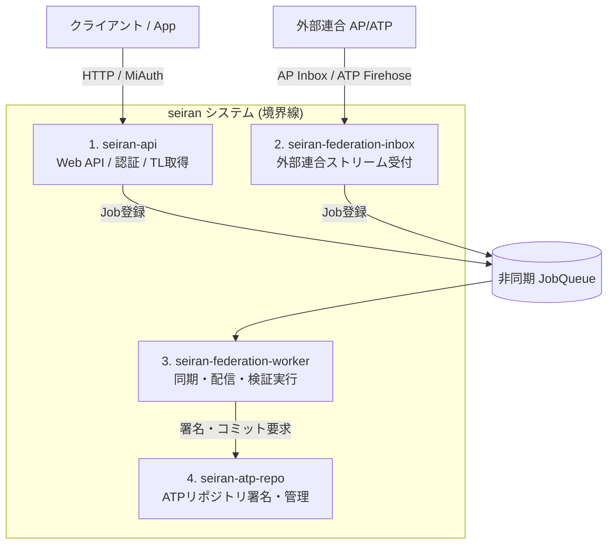

# Doc 2. アーキテクチャ ＆ 全体設計マニフェスト (Architecture & Overall Design)

## 0. フロントエンドAPI互換性（Misskey API互換レイヤー ＆ クライアント種別の前提）
本システムのバックエンドは、既存の豊富なMisskey互換フロントエンドエコシステムをそのままレバレッジするため、**Misskey APIの完全な互換レイヤー（エンドポイント群）**を実装する。

* **インターフェースの擬態:** クライアントからの `/api/notes/timeline` や `/api/notes/create` などの要求に対し、バックエンド（Rust）は内部でプロトコル間の歪みを吸収・変換し、Misskeyが期待するJSONスキーマに準拠して応答する。
* **ページネーションの翻訳:** IDベース（`sinceId` / `untilId`）のページネーションは、バックエンドで「統一ポストID（Snowflake）」クエリ、または外部宇宙（ATP等）のカーソル管理へと動的に翻訳される。
* **公式 Web フロントエンドとサードパーティ互換の境界:**
  * **公式フロントエンド（seiran公式Webクライアント）**: Vue.js/Vite等をフォークして開発し、拡張されたAPIレスポンスのメタデータ（アクターの `bridge_real_actor_id` や `parent_original_post_id` など）を自律的に解釈して、Doc 5で定義する高度な3ペインUI・警告モーダル・本尊ワープ等を描画する。
  * **サードパーティ製クライアント**: 特有のUI制御は行わず、Misskey標準のUIで動作させる。フォロー警告等は動作しない（例外的な存在であるため許容する）。代わりに、アクターの `bio`（自己紹介）の末尾に本尊のURLをAPIサーバー側で自動挿入するなどのフォールバックを行い、無改造クライアントでも体験価値を維持する。

---

## 1. ユーザー認証（Auth0 抽象化レイヤー ＆ MiAuth互換）

本システムは、セキュリティの堅牢性と開発速度を最大化するためAuth0を標準採用するが、将来のOSS（セルフホスト）化を見据えて認証プロバイダを抽象化レイヤー（インターフェース）で分離する。また、Misskeyアプリからの認可要求（MiAuth）を処理する互換エンドポイントを内蔵する。

### 1.1 認証インターフェース定義 (Rustイメージ)
```rust
#[async_trait]
pub trait AuthProvider: Send + Sync {
    /// フロントから届いたJWT/Tokenを検証し、プロバイダ側のシステム一意IDとメールアドレスを返す
    async fn verify_token(&self, token: &str) -> Result<ExtUserInfo, AuthError>;
}

pub struct ExtUserInfo {
    pub sub: String,       -- 例: "auth0|647x..." または local用の独自ID
    pub email: String,
}
```

### 1.2 認証方式の切り替え ＆ MiAuth互換
* **本家（`seiran.org`）:** 環境変数 `AUTH_PROVIDER=auth0`。Auth0 SDKを用いてJWTの署名検証、ソーシャルログイン（Google/Facebook等）を処理する。Misskeyアプリが `MiAuth`（`/miauth/authorize`）を要求してきた場合は、Auth0の認証セッションと紐付けてアクセストークンを発行・偽装する。
* **OSS配布版:** 環境変数 `AUTH_PROVIDER=local`。自前のPostgreSQL内のパスワードハッシュ（Argon2）検証と、内蔵SMTPモジュールによるメール確認（従来型）へフォールバックする。

---

## 2. 統一アクターモデルの実装ロジック

`actors` テーブルにおける「魂の結合」と「影武者紐付け」を処理するためのビジネスロジック。

### 2.1 リモート seiran ユーザーのペアリング（魂の結合）
他インスタンスの `seiran` ユーザーを発見した際、AP宇宙のレコード（行A）とATP宇宙のレコード（行B）の双方の `seiran_pair_actor_id` に互いの主キーIDを書き込む。
* アプリケーション層は、`actor_type == 'remote_seiran'` を検知した場合、常に `seiran_pair_actor_id` の有無を確認し、存在すればUIやクエリで2つのレコードを「単一のアイデンティティ」としてマージ処理する。

### 2.2 ブリッジユーザー（影武者）の判定
外部ブリッジ（Brid.gy等）によって自動生成されたアクターをインポートする際、以下のルールで `bridge_real_actor_id` をバインドする。
* Fedi側で `*.brid.gy` 由来のアカウントを検出 ➔ オリジナルのBluesky DIDを特定し、その本尊レコードのIDを `bridge_real_actor_id` に格納。
* Bsky側で `*.fed.brid.gy` 由来のアカウントを検出 ➔ オリジナルのFedi Actor URIを特定し、その本尊レコードのIDを `bridge_real_actor_id` に格納。

---

## 3. 統一ポストID 採番ルール

データベース内での完全な時系列ソート（ページネーション）を保証するため、プロトコル固有のID（URI等）とは別に、システム独自のソート可能一意IDを生成する。

### 3.1 ID構造（Snowflake / ULID準拠の64bit整数）
* **前半48bit:** ミリ秒単位のタイムスタンプ（未来補正対応）
* **後半16bit:** 衝突防止用のシリアルノードID / ランダム値

### 3.2 未来補正タイムスタンプアルゴリズム
外部プロトコルから届いたポストの `created_at` が、自サーバーの現在時刻よりも未来を指していた場合（クライアントの時計ズレ等）、そのまま格納すると最新タイムラインにそのポストが最上部に「ピン留め」された状態になりUXが破壊される。
* **補正ロジック:** `if post.created_at > SYSTEM_NOW() { id_timestamp = SYSTEM_NOW(); } else { id_timestamp = post.created_at; }`
* 採番された統一IDは `posts.id` に格納され、すべてのタイムライン描画の `ORDER BY id DESC` の主軸として機能する。

---

## 4. 大規模化を見据えた疎結合コンポーネント構成（物理分割ロードマップ）

本システムは、開発初期（プロトタイプ期）はシンプルなモノリス（単一のRustプロセス）として動作するが、将来のユーザー増加やネットワーク負荷増大に備え、各機能コンポーネント間のインターフェースを厳格に切り離す。物理的に別々のサーバー（マイクロサービス）へプロセス分割可能な以下の4つのコアコンポーネントで構成する。

### 4.1 4大コンポーネントの定義と物理分割境界



#### ① `seiran-api` (API ＆ Webサービス)
* **役割**: クライアントからのリクエスト受け口（Misskey API互換レイヤー ＆ MiAuth認可）。
* **状態性**: 完全ステートレス。セッションは `SessionStore` Trait を介して読み書きする。
* **将来の物理分割**: HTTPサーバー群として、ロードバランサーの配下で無制限に水平スケール（Scale-out）が可能。

#### ② `seiran-federation-inbox` (インバウンド・イベントゲートウェイ)
* **役割**: 外部ネットワーク（ActivityPubのInbox、AT ProtocolのFirehose）からの高頻度ストリームの受け口。
* **処理ルール**: 受け取った生のデータを即座に検証し、`inbound_activity_process` キューへ投入（エンキュー）して即座に `202 Accepted` / 成功応答を返す。重いパースやDB挿入処理はここでは行わない。
* **将来の物理分割**: 連合トラフィックの急増によるWeb API（`seiran-api`）への影響を避けるため、ストリームレシーバー専用の独立したスケーリンググループとして分離可能。

#### ③ `seiran-federation-worker` (非同期ジョブワーカー)
* **役割**: バックグラウンドジョブの実行エンジン。
* **処理ルール**: `JobQueue` からジョブをデキューし、過去ログのインポート・投稿配送・アクター検証・DB保存処理を非同期で実行する。
* **将来の物理分割**: 最もリソース（CPU・メモリ・帯域）を消費する箇所であるため、キュー（Redis等）を介してAPIサーバーとは完全に異なるインスタンス群として独立運用・スケール可能。

#### ④ `seiran-atp-repo` (ATPリポジトリ管理サービス)
* **役割**: AT Protocol（ATP）のMST（Merkle Search Tree）リポジトリの生成、レコード署名、リレーサーバーへのブロードキャスト管理。
* **状態性**: 各アクターの署名鍵やリポジトリ整合性を管理する性質上、**シーケンシャルで厳密な順序性（排他制御）が必要な半ステートフル**な領域。
* **将来の物理分割**: gRPCや内部APIを通じてAPIやWorkerからアクセスされる、シングルトン的またはアクター単位でパーティショニング（シャード）された独立サービスとして切り離し可能。

---

### 4.2 コンポーネント間の連携ルール
1. **直接のモジュールインポートの禁止**:
   * APIとWorker、あるいはWorkerとATP Repoは、互いの具象コードを直接呼び出さず、`JobQueue`（非同期ジョブの受け渡し）または抽象的なgRPC/内部RPCインターフェースを定義してやり取りする。
2. **データベース共有の段階的解消**:
   * 初期は単一のPostgreSQLを共有して実装するが、テーブル間リレーションは密に結合させず、将来的にデータベース自体もコンポーネントごとに分割（API/Worker用のアプリケーションDBと、ATP Repo用の署名/リポジトリDB）できるよう、RDB上の参照整合性を必要最小限（外部キーの排除等も検討）に留める。

---

### 4.3 Rust プロジェクト構成 (Cargo Workspaces)
ソフトウェア境界を物理的な境界と完全に一致させるため、Rustのリポジトリ構成に `Cargo Workspace` を採用し、以下のマルチパッケージ構成とする。

```text
seiran/
├── Cargo.toml
├── crates/
│   ├── seiran-api/             # Web API エンドポイント / 互換レイヤー
│   ├── seiran-federation/      # AP Inbox / ATP Firehose レシーバー
│   ├── seiran-worker/          # 各種非同期ジョブ実行ワーカー
│   ├── seiran-atp-repo/        # ATP MSTリポジトリ処理・署名
│   ├── seiran-core/            # 共通のデータ構造 (Post, Actor等)
│   └── seiran-queue/           # JobQueue / SessionStore の Trait 定義
```
